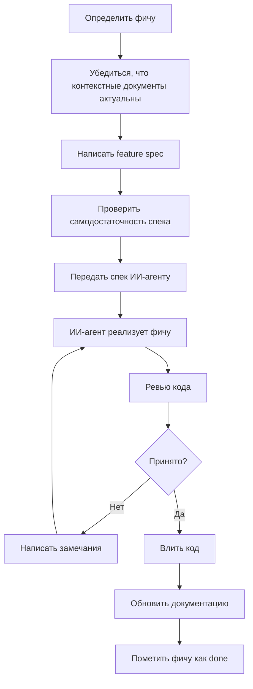

# Рабочий процесс разработки

## Роли

| Роль | Кто | Ответственность |
|---|---|---|
| Архитектор / Лид | Вы | Проектирование, написание спецификаций, ревью кода, поддержание документации в актуальном состоянии. |
| Разработчик | ИИ-агент | Чтение спецификации, реализация фичи, исправление замечаний по ревью. |

## Жизненный цикл фичи



### Шаги подробно

**1. Определить фичу.**
Выбрать следующую задачу из бэклога. Фича должна быть атомарной — одна фича решает одну задачу. Не объединять несколько фич в один спек.

**2. Убедиться, что контекстные документы актуальны.**
Перед написанием спека проверить, что базовые документы (см. раздел «Обязательные документы» ниже) отражают текущее состояние проекта. ИИ-агент будет опираться на них как на источник истины.

**3. Написать feature spec.**
Создать markdown-файл в соответствующей папке:
- `backend/docs/features/NNN-name.md` — если фича затрагивает только бэкенд
- `frontend/docs/features/NNN-name.md` — если только фронтенд
- `docs/features/NNN-name.md` — если фича сквозная (затрагивает оба слоя)

Формат спека описан в разделе «Шаблон feature spec» ниже.

**4. Проверить самодостаточность спека.**
Спек считается самодостаточным, если ИИ-агент, не имеющий предыдущего контекста, может реализовать фичу, прочитав только сам спек и указанные в нём ссылки на контекстные документы.

**5. Передать спек ИИ-агенту.**
Пример промпта:

> Реализуй фичу, описанную в `backend/docs/features/001-lobby-creation.md`.
> Для контекста прочитай: `docs/architecture.md`, `docs/data-models.md`, `docs/api-contract.md`.

**6. Ревью → замечания → повторная реализация** — итерировать до готовности.

**7. Влить код.**

**8. Обновить документацию:**
- Статус фичи в соответствующем `docs/README.md` → `done`
- `docs/api-contract.md` — если появились новые эндпоинты или WS-события
- `docs/data-models.md` — если появились новые сущности или поля
- `docs/glossary.md` — если появились новые термины

---

## Обязательные документы

Перед началом разработки фич должны существовать и поддерживаться в актуальном состоянии:

| Документ | Путь | Назначение |
|---|---|---|
| Правила игры | `docs/rules.md` | Первоисточник бизнес-логики. Все фичи ссылаются на конкретные разделы этого документа. |
| Глоссарий | `docs/glossary.md` | Единый справочник терминов с маппингом «русский термин → идентификатор в коде». Устраняет неоднозначность в спеках. |
| Архитектура | `docs/architecture.md` | Стек технологий, протоколы взаимодействия (REST / WebSocket), структура кода, принципы и ограничения. |
| Модели данных | `docs/data-models.md` | Все сущности (Player, Lobby, Session и др.) с описанием полей, типов и enum-значений. |
| API-контракт | `docs/api-contract.md` | REST-эндпоинты и WebSocket-сообщения: схемы запросов, ответов, ошибок, примеры payload. |
| Индекс фич (backend) | `backend/docs/README.md` | Таблица всех бэкенд-фич с текущими статусами. |
| Индекс фич (frontend) | `frontend/docs/README.md` | Таблица всех фронтенд-фич с текущими статусами. |

---

## Шаблон feature spec

```markdown
# Feature: [Название]

Status: draft | in-progress | done
Priority: high | medium | low
Depends on: [ссылки на другие спеки, если есть]

## Context
Зачем нужна фича. Ссылка на соответствующий раздел docs/rules.md.

## Requirements

### Functional
- Список того, что система ДОЛЖНА делать.
- Каждый пункт — тестируемый и однозначный.
- Использовать ДОЛЖЕН / СЛЕДУЕТ / МОЖЕТ (RFC 2119) для ясности.

### Non-functional
- Производительность, безопасность, потокобезопасность и т.д.

## Affected Files
- Файлы, которые нужно создать или изменить.
- Файлы, которые НЕ ТРОГАТЬ.

## Data Model
Ссылка на docs/data-models.md или описание новых сущностей.

## API (если применимо)
Ссылка на docs/api-contract.md или описание новых эндпоинтов/событий.

## UI Description (только для фронтенда)
- Описание экрана, компонентов, взаимодействий.
- Состояния: загрузка, пустой, ошибка, успех.

## Acceptance Criteria
- [ ] Конкретный чек-лист «что значит done».
- [ ] Каждый пункт проверяем.

## Edge Cases and Error Handling
- Граничные условия и сценарии ошибок.

## Out of Scope
Что фича явно НЕ покрывает.
```

---

## Принципы написания спеков для ИИ-агента

1. **Явность, не подразумевание.** Плохо: «обработай ошибки». Хорошо: «верни HTTP 409 с телом `{"error": "lobby_full"}`».
2. **Конкретные пути и паттерны.** Не «добавь эндпоинт», а «добавь хендлер в `backend/handler/lobby.go`, зарегистрируй на `mux` в `main.go` по аналогии с `/readyz`».
3. **Границы изменений.** Явно указать, какие файлы менять, какие создавать, какие не трогать.
4. **Одна фича = одна задача.** Маленький скоуп проще реализовать и проще ревьюить.
5. **Примеры.** Один JSON-пример снимает больше вопросов, чем абзац описания.
6. **Happy path + failure paths.** Агенты склонны фокусироваться на happy path; явно перечислять ошибки.
7. **Ограничения стека.** «Использовать стандартную библиотеку Go, без сторонних роутеров».

---

## Пример: планирование фичи «Управление лобби»

Допустим, следующая фича — возможность администратору кикать игроков, передавать права и менять настройки лобби. Ниже — не реализация, а перечень файлов, которые нужно создать/обновить, и краткое описание содержимого каждого.

### Документы, которые нужно обновить до начала

| Файл | Что обновить |
|---|---|
| `docs/api-contract.md` | Добавить описание WS-команд `kick_player`, `transfer_admin`, `update_settings` и соответствующего события `lobby_updated` (если ещё не описаны). |
| `docs/data-models.md` | Убедиться, что поле `isAdmin` у `Player` документировано (уже есть). |

### Feature spec

| Файл | Описание содержимого |
|---|---|
| `backend/docs/features/002-lobby-management.md` | **Feature spec.** Context: ссылка на rules.md разделы 3.1 и 3.2. Requirements: три WS-команды (kick, transfer, update_settings) — для каждой описать кто может вызвать, валидации, коды ошибок, broadcast-событие. Affected files: `backend/handler/ws.go` (добавить обработку новых команд), `backend/game/lobby.go` (добавить методы `KickPlayer`, `TransferAdmin`, `UpdateSettings`). Файлы НЕ трогать: `frontend/**`, `backend/handler/lobby.go`. Acceptance criteria: 8–10 пунктов (кик работает, кик себя невозможен, кик не-админом — ошибка, и т.д.). Out of scope: UI для настроек, ready/start логика. |

### Код (что создаст/изменит ИИ-агент)

| Файл | Описание изменений |
|---|---|
| `backend/game/lobby.go` | Добавить методы: `KickPlayer(adminId, targetId) error`, `TransferAdmin(adminId, targetId) error`, `UpdateSettings(adminId, settings LobbySettings) error`. Каждый метод валидирует права и возвращает типизированную ошибку. |
| `backend/handler/ws.go` | Добавить case-ветки в switch по `type` входящих WS-сообщений: `kick_player`, `transfer_admin`, `update_settings`. Каждая ветка вызывает соответствующий метод `Lobby`, при ошибке отправляет персональное `error`-событие, при успехе — broadcast `lobby_updated`. |

### Документы, которые нужно обновить после реализации

| Файл | Что обновить |
|---|---|
| `backend/docs/README.md` | Добавить строку: `002 | Управление лобби | done | features/002-lobby-management.md`. |
| `backend/docs/features/002-lobby-management.md` | Статус → `done`. |
| `docs/api-contract.md` | Убедиться, что актуальные payload-ы совпадают с реализацией; обновить при расхождении. |
